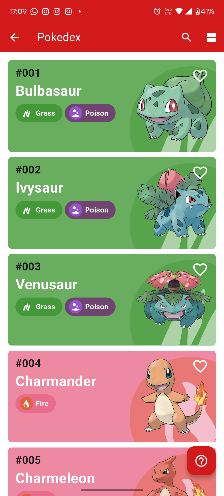
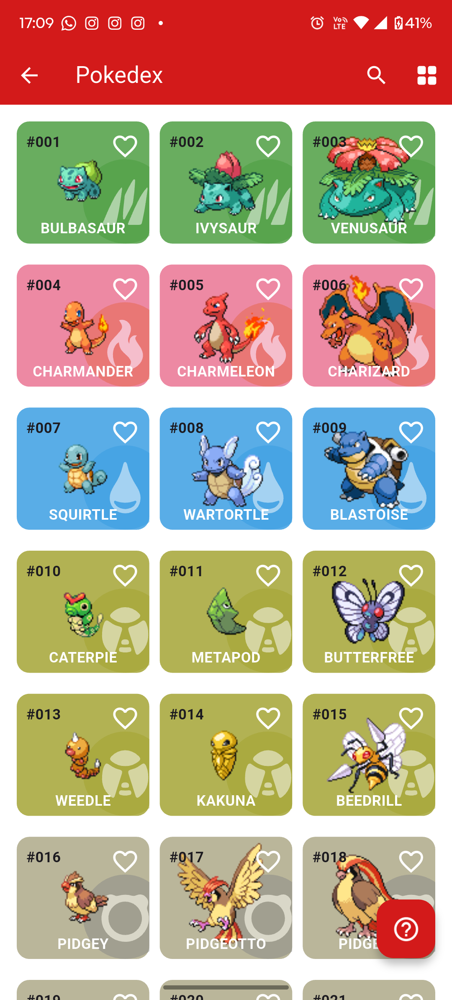
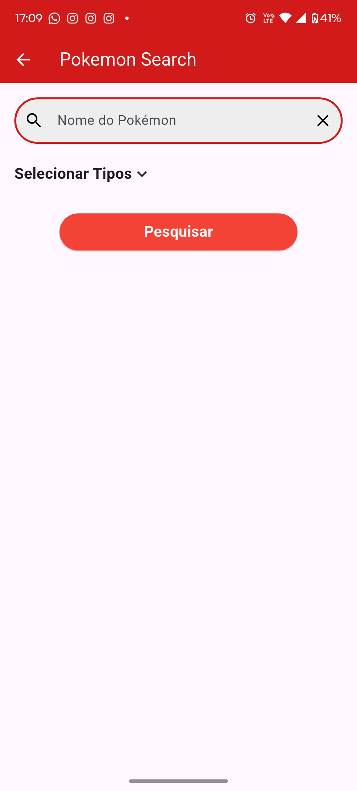

<h1 align="center">Flutter Pokédex App</h1>

  A modular and scalable Flutter application built with <strong>GetIt</strong>, <strong>MobX</strong>, and <strong>Dio</strong>, consuming the <strong>PokéAPI</strong>.
   
  Clean architecture structure following Repository → Service → ViewModel (MVVM).

<h2>🚀 Features</h2>

<ul>
  <li>Pokémon list with grid and list view modes</li>
  <li>Search by name</li>
  <li>Filter by type</li>
  <li>MobX global reactive state</li>
  <li>Dio-powered HTTP client with clean error handling</li>
  <li>Dependency Injection using GetIt</li>
  <li>Modular structure ready for scaling</li>
</ul>

<h2>📁 Project Structure</h2>

<pre>
lib/
│
├── core/
│   ├── enums/
│   │   ├── grid_type_enum.dart
│   │   └── types_enum.dart
│   │
│   ├── models/
│   │   ├── pokemon_base_model_response.dart
│   │   └── pokemon_model_response.dart
│   │
│   ├── network/
│   │   └── dio_client.dart
│   │
│   ├── repository/
│   │   ├── pokedex_repository.dart
│   │   └── pokedex_repository_impl.dart
│   │
│   └── services/
│       ├── pokedex_service.dart
│       └── service_locator.dart
│
├── home/
│   └── modules/
│       ├── pokedex_search/
│       │   ├── view/
│       │   └── view_model/
│       │
│       └── pokedex_selection/
│           ├── view/
│           └── view_model/
│
├── shared/
│
└── main.dart
</pre>

<h2>🧠 Technologies Used</h2>

<ul>
  <li><strong>MobX</strong> – reactive state management</li>
  <li><strong>GetIt</strong> – dependency injection</li>
  <li><strong>Dio</strong> – HTTP client</li>
  <li><strong>MVVM Architecture</strong></li>
  <li><strong>PokéAPI</strong> as data provider</li>
</ul>

<h2>🛠️ Installation</h2>

<pre>
git clone https://github.com/Romulo1209/Pokedex-Flutter.git
cd your-repo
flutter pub get
flutter run
</pre>

<h2>🔌 Dependency Injection (GetIt)</h2>

<pre>
void setupLocator() {
  GetIt.I.registerLazySingleton(() => DioClient());
  GetIt.I.registerLazySingleton(() => PokedexRepositoryImpl());
  GetIt.I.registerLazySingleton(() => PokedexService());
}
</pre>

<h2>⚡ State Management (MobX)</h2>

<pre>
class PokedexStore = _PokedexStoreBase with _$PokedexStore;

abstract class _PokedexStoreBase with Store {
  @observable
  ObservableList<PokemonModel> pokemons = ObservableList();

  @action
  Future<void> loadPokemons() async {
    pokemons = await service.getPokemons();
  }
}
</pre>

<h2>🌐 API</h2>

  This project uses the official PokéAPI: 
  <a href="https://pokeapi.co/" target="_blank">https://pokeapi.co/</a>

<h2>🖼️ Screenshots</h2>

Add your images here:

<pre>

</pre>

<h2>📌 Roadmap</h2>

<ul>
  <li>[ ] Favorite Pokémon System</li>
  <li>[ ] Enhanced filtering</li>
  <li>[ ] Animations for transitions</li>
  <li>[ ] Offline caching</li>
</ul>

<h2>📜 License</h2>

This project is licensed under the MIT License.

